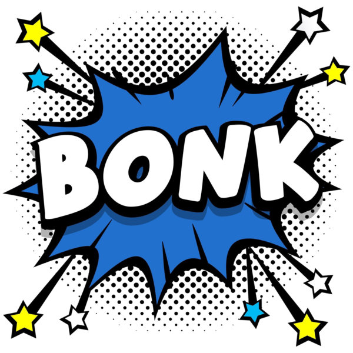

<p align="center">
  
</p>

<h1 align="center">bonk</h1>

<p align="center"><em>Pattern-interrupt &amp; context re-grounding for Claude Code — stop the wrong path, audit the assumptions, restart clean.</em></p>

<p align="center">
  <a href="https://github.com/fr1j0/bonk/tags"></a>
  <a href="https://docs.claude.com/en/docs/claude-code"></a>
  <a href="LICENSE"></a>
  <a href="https://github.com/fr1j0/bonk/issues"></a>
</p>

<p align="center">
  
  
  
</p>

---

When the agent commits to a wrong path and keeps compounding it — defending the
bad approach turn after turn — `bonk` halts it, audits what it's actually
assuming, and (when the context is too far gone) restarts from a clean, verified
problem statement re-derived by a fresh-context subagent.

The real problem usually isn't the model's reasoning — it's the **polluted
context** it keeps conditioning on (stale assumptions, dead ends, its own prior
commitments). `bonk` is about re-grounding that context, not scolding the model.

## 📦 Install

In Claude Code:

```
/plugin marketplace add fr1j0/bonk
/plugin install bonk@bonk
```

Then use `/bonk:it` and `/bonk:resume`.

## 🛑 Usage ritual

`bonk` runs *after* you've stopped the agent (a slash command can't interrupt a
running turn — only `Esc` can):

```
Esc            # stop the wrong-path execution immediately
(Esc Esc       # optional: rewind to undo bad edits
 or /rewind)
/bonk:it [hint] # re-ground on the clean state
```

> Note: `/rewind` only undoes edits made by Claude's edit tools — not bash
> side-effects (`rm`/`mv`/generated files), which need git.

> Note: run `/bonk:it` and `/bonk:resume` in the **same project**. The clean brief
> is saved under the repo root's `.bonk/` (resolved via `git`, so any subdirectory
> of the repo works), but resuming from a *different* repo — or outside any repo,
> where it anchors to the working directory — won't find it.

## 🧭 Commands

- **`/bonk:it [optional hint]`** — emits a **Drift check** report: what triggered
  it, a plain-language verdict (🛑 *start over* or ✅ *keep going*), the load-bearing
  assumptions ranked by confidence, and the context it's working from. On *start
  over*, a fresh-context subagent re-derives the approach blind to the bad turns;
  you approve, and it persists a clean brief.
- **`/bonk:resume`** — after you `/clear`, rehydrates the clean brief into the
  fresh context and continues from the corrected approach.

> Want to see the report format? Run `bash plugins/bonk/scripts/preview-report.sh`
> for a rendered sample.

## 📍 Status

v0.4.0 shipped. See [the design spec](docs/superpowers/specs/2026-06-16-bonk-design.md)
for the full design and [the plan](docs/superpowers/plans/2026-06-16-bonk-v1.md)
for how it was built; the [report-format redesign](docs/superpowers/specs/2026-06-16-report-format-redesign-design.md)
covers the current Drift-check report.
